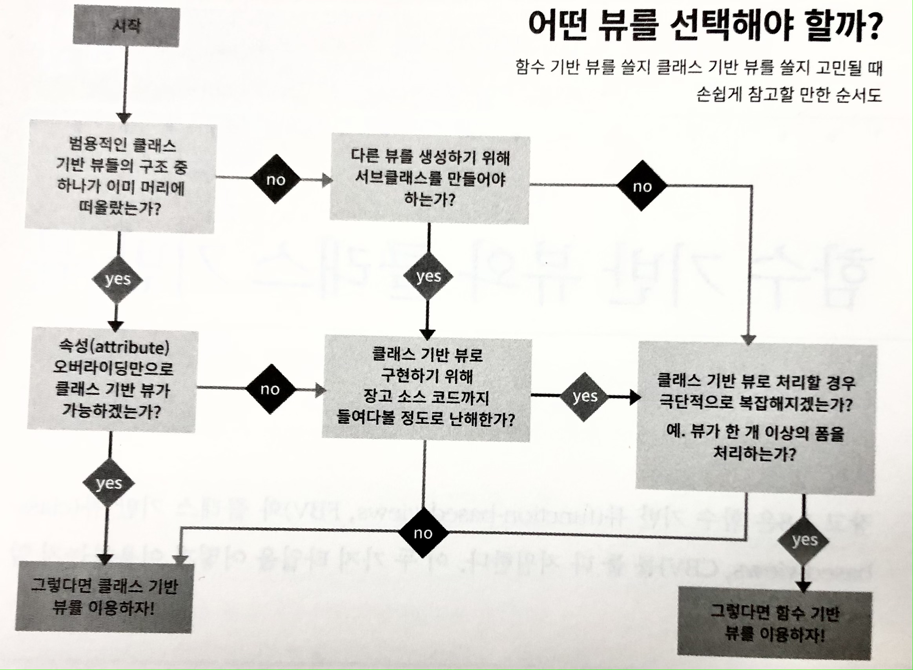

# chap8. Function-And Class Based Views

## 8.1 When to Use FBV or CBVs



- FBV나 CBV 어떤 걸 사용해도 사실 상관은 없지만, CBV를 추천
- 하지만 CBV로 구현했을때 FBV 보다 복잡해진다면 FBV를 사용해야 합니다.

## 8.2 Keep View Logic Out of URL Confs

- [Django의 디자인 철학](https://docs.djangoproject.com/en/3.2/misc/design-philosophies/#url-design)에 의하면 '뷰와 URL의 결합은 최대한의 유연성을 제공하기 위해 느슨하게 구성되어야한다'
- 뷰 로직은 뷰 모듈에, URL 로직은 URL 모듈에 포함해야 합니다.

```python
# Don't do this!
urlpatterns = [
    path('<int:pk>',
        DetailView.as_view(
            model=Tasting,
            template_name='tastings/detail.html'),
        name='detail'),
    path('<int:pk>/results/',
        DetailView.as_view(
            model=Tasting,
            template_name='tastings/results.html'),
        name='results'),
    ]        
```

다음과 같은 부문이 Django의 디자인 철학에 어긋납니다.

- Views, urls, models 사이에는 **Loose coupling**(느슨한 결합) 대신 tight coupling(종속적인 결합)이 되어 있다.
- **Don't Repeat Yourself**. CBV에서 비슷한 인자들이 반복되어 입력되어 있다.
- 확장성 파괴. CBV의 최대 장점인 클래스의 상속이 안티 패턴으로 인해 사용 불가 상태

## 8.3 Stick to Loose Coupling in URL Confs

위 안좋은 예의 코드를 views.py와 urls.py로 나눕니다.

```python
# views.py
from django.urls import reverse
from django.views.generic import ListView, DetailView, UpdateView
from .models import Tasting

class TasteListView(ListView):
    model = Tasting
    
class TasteDetailView(DetailView):
    model = Tasting
    
class TasteResultsView(TasteDetailView):
    template_name = 'tastings/results.html'
    
class TasteUpdateView(UpdateView):
     model = Tasting
    
    def get_success_url(self):
        return reverse('tastings:detail',
               kwargs={'pk': self.object.pk})
```

```python
# tastings/urls.py
from django.urls import path
from . import views

urlpatterns = [
    path(
        route='',
        view=views.TasteListView.as_view(),
        name='list'
        ), 
    path(
        route='<int:pk>/',
        view=views.TasteDetailView.as_view(),
        name='detail'
        ), 
    path(
        route='<int:pk>/results/',
        view=views.TasteResultsView.as_view(),
        name='results'
        ), 
    path(
        route='<int:pk>/update/',
        view=views.TasteUpdateView.as_view(),
        name='update'
    )
]
```

- **Don't Repeat Yourself**: 뷰들 사이에서 인자나 속성이 중복 사용되지 않는다.
- **Loose coupling**: URLConf에서 모델과 템플릿이름을 모두 제거하여 views와 urls를 분리하였다. 이로 하나 이상의 URLConf에서 view의 호출이 가능해졌다.
- **URLConf는 한 번에 하나의 업무를 처리해야 한다**: URLConf는 URL 라우팅이라는 한 가직 작업만 처리하는 것을 목표로 한다.
- **CBV의 장점 살리기**: 뷰 모듈에서 표준화된 정의를 가지게 되어, 다른 클래스에서 뷰를 얼마든지 상속이 가능해졌다. 인증, 권한설정 등의 추가적인 비즈니스 로직의 처리가 수월해졌다.
- **Infinite Flexibility**: 뷰 모델에서 표준화된 정의를 함에 따라 뷰는 커스텀 로직 구현이 가능해졌다.

### 8.3.1 What if We Aren't Using CBVs?

`__file__` 속성을 이용해 directory working과 정규 표현식을 사용하여 URLConf 확장을 하고, 그로 인해 끔찍한 디버깅 악몽을 만날 것입니다.. (굳이...?)

## 8.4 Use URL Namespaces

URL namespace는 앱 레벨 / 인스턴스 레벨 에서 구분자(`:`)를 제공합니다.

```python
# urls.py
urlpatterns += [
       path('tastings/', include('tastings.urls', namespace='tastings')), ]
```

```python
# views.py
class TasteUpdateView(UpdateView): 
    model = Tasting

    def get_success_url(self):
        return reverse('tastings:detail', kwargs={'pk': self.object.pk})
```

```html


Tastings


<ul>
  
    <li>
      <a href="">{{ taste.title }}</a>
      <small>
        (<a href="">update</a>)
      </small>
    </li>

</ul>

```

### 8.4.1 Makes for Shorter, More Intuitive, and Don't Repeat Yourself URL Names

URL namespace를 이용하여 URL 이름을 더 짧고, 명확하고, 반복되는 작업을 피할 수 있습니다.

### 8.4.2 Increases Interoperability with Third-Party Libraries

`<myapp>_detail` 과 같은 방법은 URL 이름을 작성하면 `<myapp>`이 충돌하는 문제가 발생할 수 있습니다.

URL namespace를 사용하여 쉽게 해결 할 수 있습니다.

```python
# urls.py
urlpatterns += [
    path('contact/',
        include('contactmonger.urls', namespace='contactmonger')),
    path('report-problem/',
        include('contactapp.urls', namespace='contactapp')),
]
```

```html

Contact

<p>
  <a href="">Contact Us</a>
</p>
<p>
  <a href="">Report a Problem</a>
</p>

```

### 8.4.3 Easier Searches, Upgrades, and Refactors

PEP8 가이드에 따라 `tastings_detail` 와 같은 네이밍을 사용하는데,   

`tastings_detail`가 뷰 이름인지, URL 이름인지, 혹은 다른 것인지 알 수 없습니다.

`tastings:detail` 으로 작성함으로 어떤 것인지 명확히 구분 할 수 있습니다.

추가로, 새로운 서드 파티 라이브러리와 상호 연동시 좀 더 쉽게 업그레이드 및 리팩터링 할 수 있습니다.

### 8.4.4 Allows for More App and Template Reverse Tricks

Trick(꼼수)은 일반적으로 프로젝트의 복잡성만 높이기 때문에 지양해야 하지만, 몇몇은 trick은 고려해볼 만 합니다.

- `django-debug-toolbar` 와 같은 디버그 레벨에서 내부적인 검사를 실행하는 개발 도구
- 최종 사용자들에게 '모듈'을 추가하게 하여 사용자 계정의 기능을 변경하는 프로젝트

개발자들은 URL namespace를 이용하여 Trick을 구현할 수 있지만, 가장 단순 명료한 해결방안을 먼저 고민해야 합니다.

## 8.5 Try to Keep Business Logic Out of Views

예전에는 복잡한 비즈니스 로직을 뷰에 구현했습니다.

하지만, 뷰에 새로운 기능(ex,PDF 생성, 지원 포맷, REST API 등)들을 추가해야 할 경우 어려움을 격게 됩니다.

이 때문에 모델 메서드, 매니저 메서드, 일반적인 유틸리티 헬퍼 함수들을 이용하는 전략을 선호하게 되었습니다.

이렇게 비즈니스 로직을 분리하면 쉽게 재사용이 가능한 컴포넌트가 되고, 이로 인해 확장이 매우 용이해짐

## 8.6 Django Views Are Functions

기본적으로 Django의 뷰는 HTTP를 요청하는 객체를 받아서 HTTP를 응답하는 개체로 변경하는 함수입니다. 이는 수학의 함수와 비슷한 개념입니다.

```python
# 수학에서의 함수식
y = f(x)

# Django의 FBV
HttpResponse = view(HttpRequest)

# CBV로 변형한 예
HttpResponse = View.as_view()(HttpRequest)
```

### 8.6.1 The Simplest Views

```python
from django.http import HttpResponse
from django.views.generic import View

# FBV의 기본형태
def simplest_view(request):
    # Business logic goes here
    return HttpResponse('FBV')

# CBV의 기본형태
class SimplestView(View):
    def get(self, request, *args, **kwargs):
        # Business logic goes here
        return HttpResponse('CBV')
```

기본 형태가 중요한 이유

- 종종 우린 한 기능만 따로 떼어 놓은 관점이 필요할 때가 있다.
- 가장 단순한 형태로 된 Django View를 이해했다는 것은 Django View의 역할을 명확히 이해했다는 것
- Django의 FBV는 HTTP 메서드에 중립적이지만, CBV는 HTTP 메서드의 선언이 필요

## 8.7 Don't Use `locals()` as Views Context

- `locals()` 를 호출형으로 반환하는 것은 안티 패턴
  - `locals()` 는 긴 목록을 입력하는 것을 피하기 위한 트릭
  - but, '명시적인 것이 암시적인 것보다 낫다.'

- 안티 패턴 형식이 되어 버려서, 유지보수하기에 복잡한 형태가 됨
- 뷰가 어떤걸 반환하려하는지 알 수 없음
- 코드가 수정되어도 차이점을 찾기 어려움

```python
# Don't do this!
def ice_cream_store_display(request, store_id):
    store = get_object_or_404(Store, id=store_id)
    date = timezone.now()
    return render(request, 'melted_ice_cream_report.html', locals())
```

```python
def ice_cream_store_display(request, store_id):
    return render(
        request,
        'melted_ice_cream_report.html',
        {
            'store': get_object_or_404(Store, id=store_id),
            'now': timezone.now()
        }
)
```

## 8.8 Summary

- CBV, FBV를 다루어야 하는 경우
- URLConf에서 뷰 로직을 분리하는 방법
- CBV를 이용할 때 객체 상속을 이용하여 코드의 재사용성을 높이기