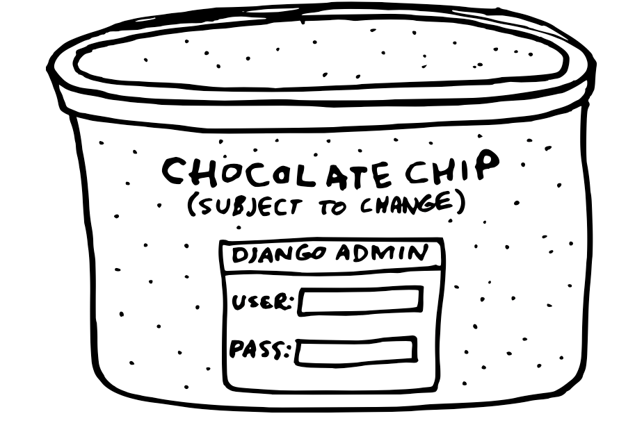
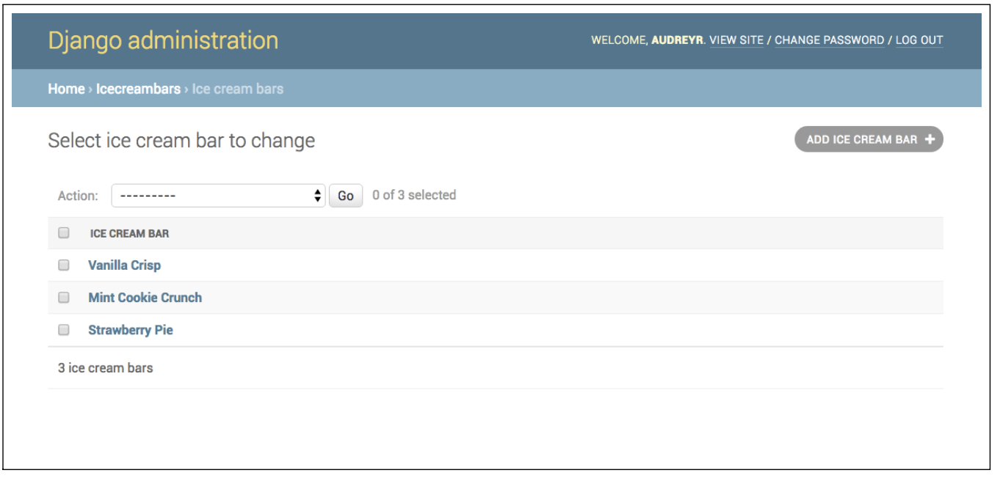

# 21 장 DjangoAdmin 으로 작업하기

When people ask, “What are the benefits of Django over other web frameworks?” the admin is what usually comes to mind.
> 사람들이 "다른 웹 프레임워크에 비해 Django의 이점은 무엇입니까?"라고 물을 때 일반적으로 관리자가 떠오릅니다.

Imagine if every gallon of ice cream came with an admin interface. You’d be able to not just see the list of ingredients, but also add/edit/delete ingredients. If someone was messing around with your ice cream in a way that you didn’t like, you could limit or revoke their access.
> 모든 갤런의 아이스크림에 관리 인터페이스가 포함되어 있다고 상상해 보십시오. 성분 목록만 보는 것이 아니라 성분 추가/수정/삭제도 가능합니다. 누군가가 당신이 좋아하지 않는 방식으로 당신의 아이스크림을 어지럽히고 있다면, 당신은 그들의 접근을 제한하거나 취소할 수 있습니다.


그림 21.1: 관리 인터페이스가 있는 초콜릿 칩 아이스크림

Pretty surreal, isn’t it? Well, that’s what web developers coming from another background feel like when they first use the Django admin interface. It gives you so much power over your web application automatically, with little work required.
> 꽤 초현실적이죠? 다른 웹 개발 진영에서 온 개발자가 Django 관리자를 처음 사용할 때 느끼는 것과 같습니다. 필요한 작업이 거의 없이 자동으로 웹 애플리케이션에 대한 강력한 기능을 제공합니다.

### 21.1 It’s Not for End Users
21.1 최종 사용자를 위한 것이 아닙니다

The Django admin interface is designed for site administrators, not end users. It’s a place for your site administrators to add/edit/delete data and perform site management tasks.
> Django 관리자 인터페이스는 최종 사용자가 아닌 사이트 관리자를 위해 설계되었습니다. 사이트 관리자가 데이터를 추가/편집/삭제하고 사이트 관리 작업을 수행하는 곳입니다.

Although it’s possible to stretch it into something that your end users could use, you really shouldn’t. It’s just not designed for use by every site visitor.
> 최종 사용자가 사용할 수 있도록 확장하는 것이 가능하지만 실제로는 안됩니다. 모든 사이트 방문자가 사용하도록 설계된 것은 아닙니다.

### 21.2 Admin Customization vs. New Views
21.2 관리자 커스텀 VS 신규 Views

It’s usually not worth it to heavily customize the Django admin.
> 일반적으로 Django 관리자를 크게 사용자 정의하는 것은 가치가 없습니다.

Sometimes, creating a simple view or form from scratch results in the same desired functionality with a lot less work. 
> 때로는 간단한 View 나 폼을 처음부터 생성하면 훨씬 적은 작업으로 원하는 기능이 동일하게 생성됩니다.

We’ve always had better results with creating custom management dashboards for client projects than we have with modifying the admin to fit the need of the client.
> 클라이언트의 필요에 맞게 관리자를 수정하는 것보다 클라이언트 프로젝트에 대한 사용자 지정 관리 대시보드를 만들 때 항상 더 나은 결과를 얻었습니다.

### 21.3 Viewing String Representations of Objects
21.3 객체의 문자열 표현 보기

The default admin page for a Django app shows a list of generic looking objects like this:
> Django 앱의 기본 관리 페이지는 다음과 같은 일반적인 개체 목록을 보여줍니다.


Figure 21.2: Admin list page for an ice cream bar app.
> 그림 21.2: 아이스크림 바 앱의 관리자 목록 페이지.

That’s because the default string representation of an IceCreamBar object is “IceCreamBar object”. Wouldn’t it be helpful to display something better?
> IceCreamBar 객체의 기본 문자열 표현은 "IceCreamBar 객체"이기 때문입니다. 더 좋은 모습을 보여드리는 것이 도움이 되지 않을까요?


Figure 21.3: What? An admin interface for ice cream bars?
> 그림 21.3: 무엇? 아이스크림 바에 대한 관리 인터페이스?

21.3.1 `__str__()` 사용하기
Implementing __str__() is straightforward:

`__str__()` 구현은 간단합니다.

Example 21.1: String Representation of Objects
예제 21.1: 객체의 문자열 표현

```python
from django.db import models

class IceCreamBar(models.Model):
	name = models.CharField(max_length=100)
	shell = models.CharField(max_length=100)
	filling = models.CharField(max_length=100)
	has_stick = models.BooleanField(default=True)

def __str__(self):
	return self.name
```

The result is as follows:
> 결과는 다음과 같습니다.

Figure 21.4: Improved admin list page with better string representation of our objects.
> 그림 21.4: 개체의 더 나은 문자열 표현으로 개선된 관리자 목록 페이지.

)

It’s more than that. When you’re in the shell, you see the better string representation:
> 그 이상입니다. 쉘에 있을 때 더 나은 문자열 표현을 볼 수 있습니다.

Example 21.2: List of Ice Cream Bar Types
> 예 21.2: 아이스크림 막대 유형 목록

```bash
   >>> IceCreamBar.objects.all()
   [<IceCreamBar: Vanilla Crisp>, <IceCreamBar: Mint Cookie Crunch>,
   <IceCreamBar: Strawberry Pie>]
```

The __str__() method is called whenever you call str() on an object. This occurs in the Django shell, templates, and by extension the Django admin. Therefore, try to make the results of __str__() nice, readable representation of Django model instances.
> `__str__()` 메서드는 객체에서 `str()`을 호출할 때마다 호출됩니다. 이것은 Django 셸, 템플릿 및 확장하여 Django 관리자에서 발생합니다. 따라서 `__str()__()`의 결과를 Django 모델 인스턴스의 읽기 쉬운 표현으로 만들기 위해 노력하십시오.

21.3.2 Using list_display
21.3.2 list_display 사용하기

If you want to change the admin list display in a way that isn’t quite a string representation of the object, then use list_display.
> 객체의 문자열 표현이 아닌 방식으로 관리자 목록 표시를 변경하려면 list_display를 사용하십시오.

Example 21.3: Admin List Display
> 예 21.3: 관리자 목록 표시

```bash
from django.contrib import admin
from .models import IceCreamBar

@admin.register(IceCreamBar)
class IceCreamBarModelAdmin(admin.ModelAdmin):
    list_display = ('name', 'shell', 'filling')
```

The result with the specified fields:
> 지정된 필드의 결과:


Figure 21.5: Further improvements to the admin list page.
> 그림 21.5: 관리자 목록 페이지에 대한 추가 개선 사항.

### 21.4 Adding Callables to ModelAdmin Classes
21.4 ModelAdmin 클래스에 Callables 추가하기

You can use callables such as methods and functions to add functionality to the Django `django.contrib.admin.ModelAdmin` class. This allows you to really modify the list and display screens to suit your ice cream project needs.
> 메서드 및 함수와 같은 호출 가능 항목을 사용하여 Django `django.contrib.admin.ModelAdmin` 클래스에 기능을 추가할 수 있습니다. 이를 통해 아이스크림 프로젝트 요구 사항에 맞게 목록 및 표시 화면을 실제로 수정할 수 있습니다.

For example, it’s not uncommon to want to see the exact URL of a model instance in the Django admin. If you define a get_absolute_url() method for your model, what Django provides in the admin is a link to a redirect view whose URL is very different from the actual object URL. Also, there are cases where the get_absolute_url() method is meaningless (REST APIs come to mind).
> 예를 들어, Django 관리자에서 모델 인스턴스의 정확한 URL을 보고 싶어하는 것은 드문 일이 아닙니다. 모델에 대해 `get_absolute_url()` 메서드를 정의하면 Django가 관리자에서 제공하는 것은 URL이 실제 개체 URL과 매우 다른 리디렉션 보기에 대한 링크입니다. 또한 `get_absolute_url()` 메서드가 의미가 없는 경우도 있습니다(REST API가 떠오름).

In the example below, we demonstrate how to use a simple callable to provide a link to our target URL:
> 아래 예에서 간단한 호출 가능 항목을 사용하여 대상 URL에 대한 링크를 제공하는 방법을 보여줍니다.

Example 21.4: Adding Callables to ModelAdmin Classes
> 예제 21.4: ModelAdmin 클래스에 호출 가능 추가

```python
# icecreambars/admin.py
from django.contrib import admin
from django.urls import reverse, NoReverseMatch
from django.utils.html import format_html
from .models import IceCreamBar

@admin.register(IceCreamBar)
class IceCreamBarModelAdmin(admin.ModelAdmin):
	list_display = ('name', 'shell', 'filling')
	readonly_fields = ('show_url',)
	
	def show_url(self, instance):
		url = reverse('icecreambars:ice_cream_bar_detail', kwargs={'pk':instance.pk})
		response = format_html("""<a href="{0}">{0}</a>""", url)
		return response
	
	show_url.short_description = 'Ice Cream Bar URL'
```

Since a picture is worth a thousand words, here is what our callable does for us:
> 그림은 천 마디 말의 가치가 있으므로 Callable 이 우리를 위해 하는 일은 다음과 같습니다.


Figure 21.6: Displaying URL in the Django Admin.
> 그림 21.6: Django Admin에 URL 표시

WARNING: Always Use format_html When Presenting Data From Users
> 경고: 사용자로부터 데이터를 표시할 때 항상 format_html을 사용하십시오.

Any time data is presented in the admin that includes HTML tags, use format_html to ensure that arguments are escaped during the rendering process. This is explained more at Section 28.9.1: Use format_html Over mark_safe.
> HTML 태그가 포함된 데이터가 관리자에 표시될 때마다 format_html을 사용하여 렌더링 프로세스 중에 인수가 이스케이프되도록 합니다. 이것은 28.9.1절: mark_safe보다 format_html 사용에서 자세히 설명합니다.

### 21.5 Be Aware of the Complications of Multiuser Environments
21.5 다중 사용자 환경의 복잡성을 인식하십시오

Nothing in the Django admin locks records to a particular staff- or admin-level user. While this is fine for a project with a single person with admin-level access, on a multi-user project it can be a very serious problem. Here is what happens:
> Django 관리자의 어떤 것도 특정 직원 또는 관리자 수준의 사용자에게 레코드를 잠그지 않습니다. 관리자 수준 액세스 권한이 있는 한 사람이 있는 프로젝트에는 문제가 없지만 다중 사용자 프로젝트에서는 매우 심각한 문제가 될 수 있습니다. 다음과 같은 일이 발생합니다.

1. Via the Django admin, Daniel edits the record for “Peppermint Sundae” ice cream bar. He starts to make changes. He gets a phone call from the marketing officer of Icecreamlandia and leaves his screen open.
> Daniel은 Django 관리자를 통해 "Peppermint Sundae" 아이스크림 바의 레코드를 편집합니다. 그는 변화를 일으키기 시작합니다. 그는 Icecreamlandia의 마케팅 담당자로부터 전화를 받고 화면을 열어 둡니다.
    
    
2. In the meantime, Audrey decides to modify “Peppermint Sundae” ice cream bar. She spends ten minutes making her changes, then saves the her data.
> 그 사이 Audrey는 "페퍼민트 순대" 아이스크림 바를 개조하기로 결정합니다. 그녀는 10분 동안 변경 작업을 수행한 다음 데이터를 저장합니다.

1. Daniel gets off the phone and finally saves his changes. He overwrites Audrey’s changes.
> Daniel은 전화를 끊고 마침내 변경 사항을 저장합니다. 그는 Audrey의 변경 사항을 덮어씁니다.

If you have multiple users with access to the Django admin, you need to be aware of this possibility.
> Django 관리자에 대한 액세스 권한이 있는 사용자가 여러 명이라면 이 가능성을 알고 있어야 합니다.

### 21.6 Django’s Admin Documentation Generator
21.6 Django의 관리자 문서 생성기

One of the more interesting developer tools that Django provides is the `django.contrib.admindocs` package. Created in an era before the advent of the documentation tools that we cover in Chapter 25: Documentation: Be Obsessed, it remains a useful tool.
> Django가 제공하는 더 흥미로운 개발자 도구 중 하나는 `django.contrib.admindocs` 패키지입니다. 25장: Documentation: Be Obsessed에서 다루는 문서화 도구가 등장하기 이전 시대에 만들어졌지만 여전히 유용한 도구입니다.

It’s useful because it introspects the Django framework to display docstrings for project components like models, views, custom template tags, and custom filters. Even if a project’s components don’t contain any docstrings, simply seeing a list of harder-to-introspect items like oddly named custom template tags and custom filters can be really useful in exploring the architecture of a complicated, existing application.
> Django 프레임워크를 검사하여 모델, 보기, 사용자 정의 템플릿 태그 및 사용자 정의 필터와 같은 프로젝트 구성 요소에 대한 독스트링을 표시하기 때문에 유용합니다. 프로젝트 구성 요소에 독스트링이 포함되어 있지 않더라도 이상한 이름의 사용자 지정 템플릿 태그 및 사용자 지정 필터와 같이 검사하기 어려운 항목 목록을 보는 것만으로도 복잡한 기존 응용 프로그램의 아키텍처를 탐색하는 데 매우 유용할 수 있습니다.

Using django.contrib.admindocs is easy, but we like to reorder the steps described in the formal documentation:
> `django.contrib.admindocs`를 사용하는 것은 쉽지만 공식 문서에 설명된 단계를 재정렬하고 싶습니다.

1. pip install docutils into your project’s virtualenv.
> pip install docutils를 프로젝트의 virtualenv에 설치합니다.

2. Add `django.contrib.admindocs` to your INSTALLED_APPS.
> INSTALLED_APPS에 `django.contrib.admindocs`를 추가합니다.

3. Add path('admin/doc/', include('django.contrib.admindocs.urls')) to your root URLConf. Make sure it’s included before the admin/ entry, so that requests to /admin/doc/ don’t get handled by the latter entry.
> 루트 URLConf에 path('admin/doc/', include('django.contrib.admindocs.urls'))를 추가합니다. /admin/doc/에 대한 요청이 후자 항목에 의해 처리되지 않도록 admin/ 항목 앞에 포함되었는지 확인하십시오.

4. Optional : Using the admindocs bookmarklets requires the `XViewMiddleware` to be installed.
> 선택 사항: admindocs 북마크릿을 사용하려면 `XViewMiddleware`가 설치되어 있어야 합니다.

Once you have this in place, go to /admin/doc/ and explore. You may notice a lot of your project’s code lacks any sort of documentation. This is addressed in the formal documentation on django.contrib.admindocs: docs.djangoproject.com/en/3.2/ref/contrib/admin/admindocs/ and our own chapter on Chapter 25: Documentation: Be Obsessed.
> 이 설정이 완료되면 /admin/doc/로 이동하여 탐색합니다. 많은 프로젝트 코드에 어떤 종류의 문서도 부족하다는 것을 알 수 있습니다. 이것은 django.contrib.admindocs의 공식 문서([docs.djangoproject.com/en/3.2/ref/contrib/admin/admindocs/](http://docs.djangoproject.com/en/3.2/ref/contrib/admin/admindocs/))와 25장: 문서: 집착에 대한 챕터에서 다룹니다.

### 21.7 Using Custom Skins With the Django Admin
21.7 Django Admin으로 커스텀 스킨 사용하기

Over the years there have been a number of efforts to reskin or theme the Django Admin. These range from the venerable, stable, and very popular django-grappelli to more recent up-and-comers. They allow easy-to-hard customization.
> 수년에 걸쳐 Django Admin의 스킨을 변경하거나 테마를 변경하려는 많은 노력이 있었습니다. 이들은 유서 깊고 안정적이며 매우 인기 있는 `django-grappelli`에서 최근에 떠오르는 신예에 이르기까지 다양합니다. 그들은 쉽고 어려운 사용자 정의를 허용합니다.

PACKAGE TIP: Custom django.contrib.admin Skins
> 패키지 팁: 사용자 지정 django.contrib.admin 스킨

Here are some of the more popular custom skins:
> 다음은 더 인기 있는 사용자 정의 스킨 중 일부입니다.

django-grappelli is the grand-daddy of all custom Django skins. Stable, robust, and with a unique but friendly style.
> `django-grappelli`는 모든 사용자 지정 Django 스킨의 할아버지입니다. 안정적이고 견고하며 독특하지만 친근한 스타일입니다.

django-suit is built using the familiar Bootstrap front-end framework.
> `django-suit`는 친숙한 Bootstrap 프론트엔드 프레임워크를 사용하여 구축되었습니다.

jet-admin is an API-based Admin Panel Framework.
> `jet-admin`은 API 기반 관리자 패널 프레임워크입니다.

A more complete list can be found at
> 더 완전한 목록은 다음에서 찾을 수 있습니다.

[djangopackages.org/grids/g/admin-styling/](https://djangopackages.org/grids/g/admin-styling/)
Django has a gigantic community, so why aren’t there more skins?
> Django에는 거대한 커뮤니티가 있는데 왜 더 많은 스킨이 없을까요?

It turns out that besides the most basic CSS-based modifications, creating custom Django themes is very challenging. For anyone who has delved into the source code for these projects, it’s clear that custom admin skins require arcane code to account for some of the idiosyncrasies of django.contrib.admin.
> 가장 기본적인 CSS 기반 수정 외에도 사용자 지정 Django 테마를 만드는 것은 매우 어려운 일입니다. 이 프로젝트의 소스 코드를 조사한 사람이라면 사용자 지정 관리자 스킨에 `django.contrib.admin`의 일부 특이성을 설명하기 위해 신비한 코드가 필요하다는 것이 분명합니다.

Patrick Kranzlmueller, maintainer of django-grappelli, goes into great detail in his article on the subject, ‘A Frontend Framework for the Django Admin Interface’, which you can read at the link below:
> django-grappelli의 관리자인 Patrick Kranzlmueller는 아래 링크에서 읽을 수 있는 'A Frontend Framework for Django Admin Interface'라는 주제에 대한 자신의 기사에서 자세히 설명합니다.

[http://sehmaschine.net/blog/django-admin-frontend-framework](http://sehmaschine.net/blog/django-admin-frontend-framework)

Here are some tips when working with custom django.contrib.admin skins:
> 다음은 사용자 지정 django.contrib.admin 스킨으로 작업할 때의 몇 가지 팁입니다.

21.7.1 Evaluation Point: Documentation is Everything
21.7.1 평가 포인트: 문서화가 전부다

As mentioned earlier, writing a custom skin for django.contrib.admin is hard. While the successful skins are relatively easy to add to a project, it’s the edge cases (invariably involved in extending the ModelAdmin object) that can hurt.
> 앞서 언급했듯이 `django.contrib.admin`에 대한 사용자 정의 스킨을 작성하는 것은 어렵습니다. 성공한 스킨은 프로젝트에 비교적 쉽게 추가할 수 있지만, 문제가 될 수 있는 것은 예외적인 경우(ModelAdmin 개체 확장과 항상 관련됨)입니다.

Therefore, when evaluating one of these projects for use on a project, check to see how far the documentation goes beyond installation instructions.
> 따라서 프로젝트에서 사용하기 위해 이러한 프로젝트 중 하나를 평가할 때 문서가 설치 지침을 어디까지 확장하는지 확인하십시오.

21.7.2 Write Tests for Any Admin Extensions You Create
21.7.2 생성한 모든 관리 확장에 대한 테스트 작성

For our purposes, we’ve found that while clients enjoy the more modern themes, you have to be careful of how far you extend these admin skins. What works great in vanilla django.contrib.admin can break in a custom skin. Since the custom skins have to wrap portions of django.contrib.admin abstractions in curious ways, debugging these problems can prove to be a mind-numbing nightmare.
> 우리의 목적을 위해 클라이언트가 보다 현대적인 테마를 즐기는 동안 이러한 관리자 스킨을 확장하는 방법에 주의해야 한다는 것을 알게 되었습니다. 바닐라 django.contrib.admin에서 잘 작동하는 것이 사용자 정의 스킨에서 깨질 수 있습니다. 사용자 지정 스킨은 `django.contrib.admin` 추상화의 일부를 이상한 방식으로 래핑해야 하므로 이러한 문제를 디버깅하는 것은 정신이 멍해지는 악몽이 될 수 있습니다.

Therefore, if you use a custom skin, the best practice is to write tests of the admin, especially for any customization. Yes, it is a bit of work up front, but it means catching these bugs much, much earlier.
> 따라서 사용자 지정 스킨을 사용하는 경우 가장 좋은 방법은 특히 모든 사용자 지정에 대한 관리자 테스트를 작성하는 것입니다. 예, 약간의 작업이 필요하지만 이러한 버그를 훨씬 더 일찍 잡는 것을 의미합니다.

For more on testing, see our writings on testing in Chapter 24: Testing Stinks and Is a Waste of Money!.
> 테스트에 대한 자세한 내용은 24장: 테스트에 악취가 나고 돈 낭비입니다!에서 테스트에 대한 글을 참조하십시오.

### 21.8 Secure the Django Admin
21.8 Django 관리자 보안

Since the Django admin gives your site admins special powers that ordinary users don’t have, it’s good practice to make it extra secure.
> Django 관리자는 사이트 관리자에게 일반 사용자에게는 없는 특별한 권한을 부여하므로 보안을 강화하는 것이 좋습니다.

21.8.1 Change the Default Admin URL
21.8.1 기본 관리 URL 변경

By default, the admin URL is yoursite.com/admin/. Change it to something that’s long and difficult to guess.
> 기본적으로 관리 URL은 [yoursite.com/admin/입니다](http://yoursite.com/admin/%EC%9E%85%EB%8B%88%EB%8B%A4). 길고 추측하기 어려운 것으로 변경하십시오.

TIP: Jacob Kaplan-Moss Talks About Changing the Admin URL
팁: Jacob Kaplan-Moss는 관리 URL 변경에 대해 이야기합니다.

Django project co-leader Jacob Kaplan-Moss says (paraphrased) that it’s an easy additional layer of security to come up with a different name (or even different domain) for the admin.
It also prevents attackers from easily profiling your site. For example, attackers can tell which version of Django you’re using, sometimes down to the point-release level, by examining the HTML content of the login screen for admin/ .
> Django 프로젝트의 공동 리더인 Jacob Kaplan-Moss는 관리자를 위해 다른 이름(또는 다른 도메인)을 제시하는 것은 쉬운 추가 보안 계층이라고 말합니다. 또한 공격자가 사이트를 쉽게 프로파일링하는 것을 방지합니다. 예를 들어 공격자는 admin/ 에 대한 로그인 화면의 HTML 콘텐츠를 검사하여 사용 중인 Django 버전을 때로는 포인트 릴리스 수준까지 알 수 있습니다.

21.8.2 Use django-admin-honeypot
21.8.2 django-admin-honeypot 사용

If you’re particularly concerned about people trying to break into your Django site, django-admin-honeypot is a package that puts a fake Django admin login screen at admin/ and logs information about anyone who attempts to log in.
> Django 사이트에 침입하려는 사람들이 특히 걱정된다면 django-admin-honeypot은 가짜 Django 관리자 로그인 화면을 admin/에 놓고 로그인을 시도하는 모든 사람에 대한 정보를 기록하는 패키지입니다.

See github.com/dmpayton/django-admin-honeypot for more information.
> 자세한 내용은 [github.com/dmpayton/django-admin-honeypot을](http://github.com/dmpayton/django-admin-honeypot%EC%9D%84) 참조하세요.

21.8.3 Only Allow Admin Access via HTTPS

21.8.3 HTTPS를 통한 관리자 액세스만 허용

This is already implied in Section 28.6: HTTPS Everywhere, but we want to especially emphasize here that your admin needs to be TLS-secured. If your site allows straight HTTP access, you will need to run the admin on a properly-secured domain, adding to the complexity of your deployment. Not only will you need a second deployment procedure, but you’ll need to include logic in your URLConf in order to remove the admin from HTTP access.
> 이것은 섹션 28.6: HTTPS Everywhere에 이미 암시되어 있지만 여기서는 특히 관리자가 TLS로 보호되어야 한다는 점을 강조하고 싶습니다. 사이트에서 직접 HTTP 액세스를 허용하는 경우 적절하게 보안된 도메인에서 관리자를 실행해야 하므로 배포가 복잡해집니다. 두 번째 배포 절차가 필요할 뿐만 아니라 HTTP 액세스에서 관리자를 제거하려면 URLConf에 논리를 포함해야 합니다.

In the experience of the authors, it’s much easier to put the whole site on TLS/HTTPS. Without TLS, if you log into your Django admin on an open WiFi network, it’s trivial for someone to sniff your admin username/password.
> 저자의 경험에 따르면 전체 사이트를 TLS/HTTPS에 배치하는 것이 훨씬 쉽습니다. TLS가 없으면 개방형 WiFi 네트워크에서 Django 관리자에 로그인하면 다른 사람이 귀하의 관리자 사용자 이름/비밀번호를 스니핑하기가 쉽습니다.

21.8.4 Limit Admin Access Based on IP
21.8.4 IP 기반 관리자 액세스 제한

Configure your web server to only allow access to the Django admin to certain IP addresses. Look up the instructions for your particular web server.
> 특정 IP 주소에 대한 Django 관리자 액세스만 허용하도록 웹 서버를 구성합니다. 특정 웹 서버에 대한 지침을 찾으십시오.

Nginx instructions [tech.marksblogg.com/django-admin-logins.html](http://tech.marksblogg.com/django-admin-logins.html)

An acceptable alternative is to put this logic into middleware. It’s better to do it at the web server level because every middleware component adds an extra layer of logic wrapping your views, but in some cases this can be your only option. For example, your platform-as-a-service might not give you fine-grain control over web server configuration.
> 허용 가능한 대안은 이 논리를 미들웨어에 넣는 것입니다. 모든 미들웨어 구성 요소가 보기를 래핑하는 추가 논리 계층을 추가하기 때문에 웹 서버 수준에서 수행하는 것이 더 좋지만 경우에 따라 이것이 유일한 옵션일 수 있습니다. 예를 들어, 서비스로서의 플랫폼은 웹 서버 구성에 대한 세밀한 제어를 제공하지 않을 수 있습니다.

### 21.9 Securing the Admin Docs

Since the Django admin docs give your site admins a view into how the project is constructed, it’s good practice to keep them extra-secure just like the Django admin. Borrowing from the previous section on the Django admin, we advocate the following:
> Django 관리자 문서는 사이트 관리자에게 프로젝트 구성 방식에 대한 보기를 제공하므로 Django 관리자처럼 사이트 관리자를 더욱 안전하게 유지하는 것이 좋습니다. Django 관리자에 대한 이전 섹션에서 차용하여 다음을 지지합니다.

Changing the admin docs URL to something besides yoursite.com/admin/doc/.
> 관리 문서 URL을 [yoursite.com/admin/doc/가](http://yoursite.com/admin/doc/%EA%B0%80) 아닌 다른 것으로 변경합니다.

Only allowing admin docs access via HTTPS.
> HTTPS를 통한 관리 문서 액세스만 허용합니다.

Limiting admin docs access based on IP.
> IP를 기반으로 관리 문서 액세스를 제한합니다.

### 21.10 Summary
21.10 요약

In this chapter we covered the following:
> 이 장에서는 다음을 다뤘습니다.

Who should be using the Django admin.
> Django 관리자를 사용해야 하는 사람

When to use the Django admin and when to roll a new dashboard.
> Django 관리자를 사용하는 시기와 새 대시보드를 실행해야 하는 시기

String representation of objects.
> 개체의 문자열 표현

Adding callables to Django admin classes.
> Django 관리자 클래스에 호출 가능 항목 추가

Using Django’s admin docs.
> Django의 관리 문서를 사용

Encouraging you to secure the Django admin.
> Django 관리자를 보호하도록 권장

Advised on working with custom Django skins.
> 사용자 정의 Django 스킨 작업에 대한 조언